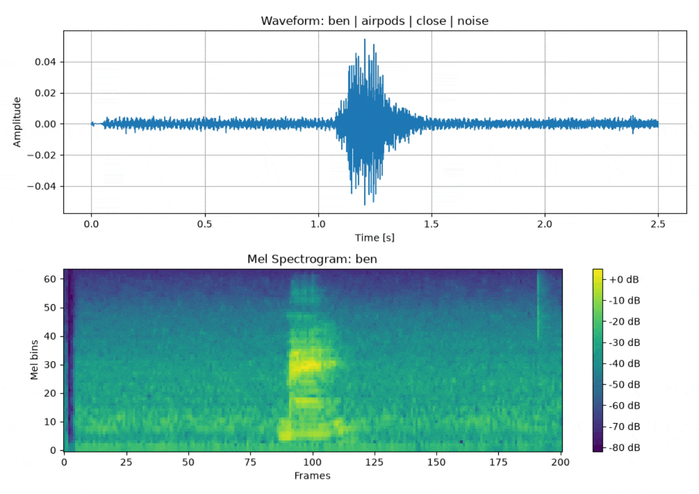
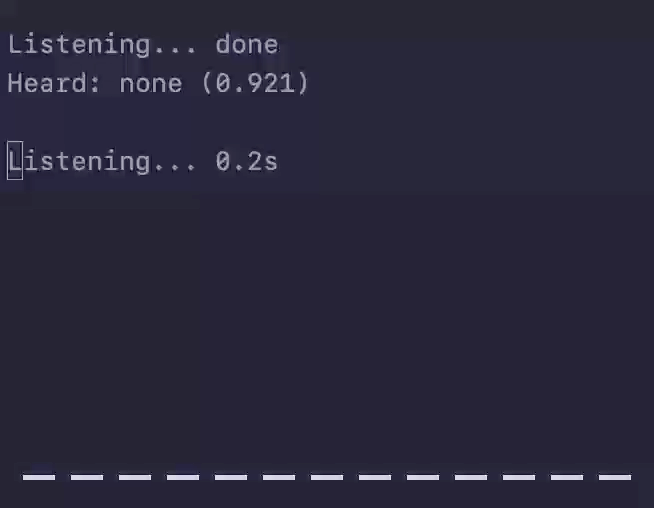

# Bentector

A small audio classifier for detecting a few iconic sounds made by Talking Ben.

It predicts one of the following classes:

- `ben`
- `yes`
- `no`
- `hohoho`
- `eughhh`
- `none`

This is a small PyTorch project made mostly for learning, rather than something production-scale.

## Dataset

The model was trained on a custom dataset of 665 audio clips.

The clips were recorded and collected from multiple sources and devices, including:

- laptop microphone
- headset microphone
- wireless earbuds microphone
- phone microphone

The dataset also includes the following recording conditions:

- close / mid / far distance
- quiet and noisy environments
- additional negative `none` samples with speech, laughter, background media, and heavier noise

All clips were standardised to 16000 Hz, mono channel, and 2.5 s duration.

> [!NOTE]
> **The dataset is not included in this repository.** Some samples contain short fragments of audio coming from YouTube videos or licensed songs, so I decided not to redistribute the raw dataset here.

## Example training samples

Below is a slideshow of different sample spectrograms from the dataset.



## Model architecture

The current model is a small CNN trained on log-mel spectrograms. The network itself consists of 3 convolutional layers. The first block expands the input channel to 16 feature maps, the second increases the count to 32, and the third to 64. Each convolution is followed by a ReLU activation and max pooling.

For the fourth layer, the model applies adaptive average pooling to compress the feature map into a compact representation, then flattens it and passes it through a final linear layer outputting 6 logits, one for each class.

Training was performed using cross-entropy loss and the Adam optimizer. Data augmentation has also been used to improve generalisation.

During inference, the output is passed through softmax to produce class probabilities. The model then selects one of 6 possible classes for each 2.5-second audio clip.

Pipeline:

1. load waveform
2. standardise waveform
3. convert to mel spectrogram
4. classify through CNN


The network predicts one of 6 classes and outputs a single best match for each 2.5-second window.

## Demo

Below is a sped up demo of `ben-listen.py`, which continuously records audio from the microphone in 2.5-second windows and passes each chunk through the model. The lower part of the image is [**CAVA**](https://github.com/karlstav/cava), the cross-platform audio visualiser by Karl Stavestrand.




## Running

```bash
# Required dependencies
pip install torch torchaudio sounddevice

# Run
python ben-listen.py --model ben_yees.pt
```


## Notes
At present, generalisation depends heavily on recording conditions and microphone quality. The model should have little to no trouble detecting Ben sounds in a quiet environment, but it may still output incorrect predictions because of limited training coverage for background sounds, human speech, or laughter.

This project is intended for educational purposes only. Outfit7, the company behind Talking Ben, is not affiliated with this project in any way.
